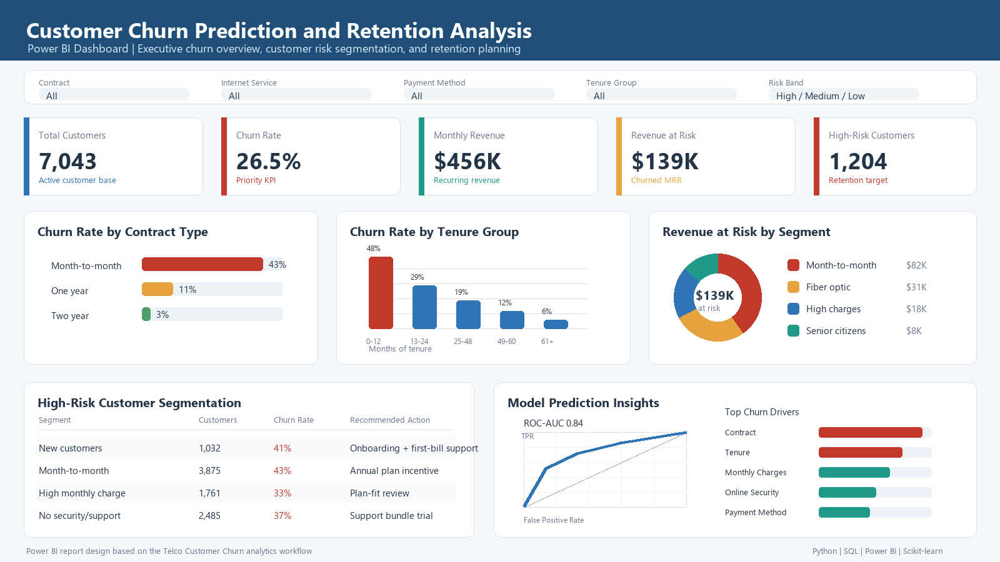

# Customer Churn Prediction and Retention Analysis

An end-to-end telecom analytics project focused on predicting customer churn,
identifying the key drivers behind churn behavior, and translating insights
into practical retention strategies.

The project uses the Kaggle Telco Customer Churn dataset and follows a
professional analytics workflow: business understanding, data quality
assessment, preprocessing, exploratory analysis, feature engineering,
classification modeling, model evaluation, dashboarding, and retention
planning.

**Dataset:** [Telco Customer Churn - Kaggle](https://www.kaggle.com/datasets/blastchar/telco-customer-churn)

## Dashboard Preview



The Power BI dashboard is designed to help business teams monitor churn KPIs,
segment high-risk customers, understand churn drivers, and prioritize
retention campaigns.

## Business Problem

Telecom companies operate in competitive markets where retaining existing
customers is often more cost-effective than acquiring new ones. Customer churn
leads to recurring revenue loss, higher acquisition pressure, lower customer
lifetime value, and reduced profitability.

This project addresses the following business question:

> Which customers are most likely to churn, why are they at risk, and what
> actions can the business take to retain them?

## Objectives

- Predict whether a customer is likely to discontinue telecom services.
- Identify customer, contract, service, and billing factors associated with
  churn.
- Compare classification models using business-relevant evaluation metrics.
- Prioritize recall to reduce missed churners.
- Build dashboard-ready outputs for customer risk segmentation.
- Recommend targeted retention strategies by customer segment.

## Key Performance Indicators

- Overall churn rate
- Churn rate by contract type, tenure group, payment method, and internet
  service
- Monthly recurring revenue at risk
- High-risk customer count
- Model recall, precision, F1-score, and ROC-AUC
- False negatives and false positives in business context

## Project Workflow

1. Business problem definition
2. Data collection and dataset understanding
3. Data quality assessment
4. Data cleaning and preprocessing
5. Exploratory data analysis
6. Feature engineering
7. Classification model training and tuning
8. Model evaluation and comparison
9. Feature importance analysis
10. Retention strategy recommendations
11. Dashboard design for business reporting

## Repository Structure

```text
.
|-- dashboard/
|   |-- powerbi_dashboard_screenshot.png
|   |-- powerbi_dashboard_spec.md
|   |-- powerbi_measures.dax
|   `-- streamlit_app.py
|-- data/
|   |-- raw/
|   |-- cleaned/
|   `-- README.md
|-- models/
|-- notebooks/
|   `-- customer_churn_prediction_and_retention_analysis.ipynb
|-- reports/
|   `-- business_insights_summary.md
|-- sql/
|   |-- schema.sql
|   `-- analysis_queries.sql
|-- src/
|   |-- build_sqlite.py
|   |-- churn_data.py
|   |-- churn_modeling.py
|   |-- churn_visuals.py
|   |-- download_kaggle_data.py
|   |-- paths.py
|   `-- run_pipeline.py
|-- visuals/
|-- README.md
`-- requirements.txt
```

## Dataset

The raw Kaggle dataset is not included in this repository. Download the file
from Kaggle and place it here:

```text
data/raw/WA_Fn-UseC_-Telco-Customer-Churn.csv
```

The dataset contains customer demographics, account details, service
subscriptions, billing information, tenure, and churn labels.

Main feature groups:

- Demographic: gender, senior citizen status, partner, dependents
- Service-related: phone service, internet service, online security, backup,
  protection, tech support, streaming services
- Account-related: tenure, contract, billing method, payment method, monthly
  charges, total charges
- Target: churn status

## Setup

```powershell
python -m venv .venv
.\.venv\Scripts\Activate.ps1
pip install -r requirements.txt
```

With Kaggle API credentials configured, the dataset can be downloaded using:

```powershell
python src/download_kaggle_data.py
```

## Run the Pipeline

```powershell
python src/run_pipeline.py
```

Optional commands:

```powershell
python src/run_pipeline.py --skip-models
python src/run_pipeline.py --skip-visuals
python src/run_pipeline.py --raw-csv data/raw/WA_Fn-UseC_-Telco-Customer-Churn.csv
```

Pipeline outputs:

- `data/cleaned/telco_churn_processed.csv`
- `data/telco_churn.sqlite`
- `reports/model_metrics.csv`
- `reports/test_set_predictions.csv`
- `reports/feature_importance.csv`
- `reports/eda_business_insights.md`
- `models/best_churn_model.joblib`
- `visuals/*.png`

## Notebook

Main notebook:

```text
notebooks/customer_churn_prediction_and_retention_analysis.ipynb
```

Notebook sections include:

- Business objective and KPIs
- Dataset overview and data quality checks
- Missing value handling and datatype conversion
- Categorical encoding and numerical scaling
- Class imbalance handling
- Exploratory data analysis with business interpretation
- Feature engineering
- Logistic Regression, Decision Tree, Random Forest, and XGBoost
- Hyperparameter tuning with cross-validation
- Accuracy, precision, recall, F1-score, ROC-AUC, and confusion matrix
- Feature importance and churn driver analysis
- Segment-wise retention recommendations

## Modeling Approach

The modeling workflow is designed around churn prevention rather than raw
accuracy alone.

Key steps:

- Convert `TotalCharges` to numeric and repair blank values for zero-tenure
  customers.
- Remove duplicate and invalid customer records.
- Encode categorical variables.
- Standardize numerical features.
- Address class imbalance with class weighting.
- Tune models using stratified cross-validation.
- Select the best model using recall first and ROC-AUC second.

Recall is especially important because a false negative means the business
misses a customer who is likely to churn. False positives still create campaign
cost, but the cost is usually lower than losing a customer completely.

## Dashboard

Power BI dashboard materials:

- Dashboard preview: `dashboard/powerbi_dashboard_screenshot.png`
- Dashboard build guide: `dashboard/powerbi_dashboard_spec.md`
- DAX measures: `dashboard/powerbi_measures.dax`

Streamlit dashboard:

```powershell
streamlit run dashboard/streamlit_app.py
```

Dashboard pages and views:

- Churn overview KPIs
- Customer risk segmentation
- Revenue at risk analysis
- Contract, billing, tenure, and service analysis
- Feature importance and model prediction insights
- Retention strategy planning

## Retention Recommendations

Recommended business actions include:

- Personalized retention campaigns for high-risk customers
- Long-term contract incentives for month-to-month customers
- Billing support and plan-fit reviews for high monthly charge customers
- Onboarding improvements for new customers
- Support-focused outreach for senior citizens
- Security and tech support bundles for customers without protective services
- Monthly churn-risk monitoring for customer success teams

## Tech Stack

- Python
- Pandas and NumPy
- Matplotlib and Seaborn
- Scikit-learn
- XGBoost
- SHAP
- SQL and SQLite
- Streamlit
- Power BI

## Portfolio Summary

Built a complete telecom churn analytics project using Python, SQL, predictive
modeling, and dashboard reporting. The project includes data cleaning, feature
engineering, exploratory analysis, model tuning, churn driver interpretation,
customer risk segmentation, and retention strategy recommendations for a
business-facing analytics use case.
